## Custom Level Support for Airlocks and Doors

This branch implements an approach that allows the use of airlocks and every other door type from the game in custom levels.
It also allows editing every vanilla door’s data through files organized by level inside a folder called `airlock-data`.

**Note:** This system is disabled by default. To enable it, you must edit `game.gd`.

`<ROOT FOLDER>\goal_src\jak2\dgos\game.gd`

Scroll to the bottom of the file, **comment out** the original `airlock.o` line, and then add the following block below it:

```lisp
  "airlock-customizable-h.o" ;; added - airlock customizable data definitions file
  ;; atoll
  "atoll-airlock-data.o"
  ;; atollext
  "atollext-airlock-data.o"
  ;; city
  "consite-airlock-data.o"
  "consiteb-airlock-data.o"
  "ctyfarma-airlock-data.o"
  "ctygenb-airlock-data.o"
  "ctyinda-airlock-data.o"
  "ctyindb-airlock-data.o"
  "ctypal-airlock-data.o"
  "ctyport-airlock-data.o"
  "ctysluma-airlock-data.o"
  "ctyslumb-airlock-data.o"
  "ctyslumc-airlock-data.o"
  "gungame-airlock-data.o"
  "hideout-airlock-data.o"
  "hiphog-airlock-data.o"
  "oracle-airlock-data.o"
  "stadium-airlock-data.o"
  "vinroom-airlock-data.o"
  ;; fortress
  "fordumpa-airlock-data.o"
  "fordumpc-airlock-data.o"
  "forexitb-airlock-data.o"
  "forresca-airlock-data.o"
  "forrescb-airlock-data.o"
  "prison-airlock-data.o"
  ;; ruins
  "ruins-airlock-data.o"
  ;; sewer
  "sewerb-airlock-data.o"
  "sewescb-airlock-data.o"
  ;; palace
  "palcab-airlock-data.o"
  "palent-airlock-data.o"
  "palroof-airlock-data.o"
  "palshaft-airlock-data.o"
  "throne-airlock-data.o"
  ;; under
  "under-airlock-data.o"
  "underb-airlock-data.o"
  ;; caspad
  "caspad-airlock-data.o"
  ;; castle
  "castle-airlock-data.o"
  "casboss-airlock-data.o"
  ;; drill
  "drillmtn-airlock-data.o"
  ;; tomb
  "tomba-airlock-data.o"
  "tombboss-airlock-data.o"
  "tombc-airlock-data.o"
  "tombd-airlock-data.o"
  ;; mountain
  "mountain-airlock-data.o"
  "airlock-customizable.o" ;; added - airlock customizable data logic file
```
These are **all the required file entries** for this system.

It is also recommended to check how vanilla airlock data are defined in these files, as this helps you understand how they work
and serves as a reference when defining their behavior for your own custom levels.

Below is an example showing **how to add and define airlock entity behavior in a custom level**.

### Getting Started

First, you need to create two levels that connect through an entrance, just like the game does for airlocks and doors.

**Important:** Only one of the two connected levels should be loaded initially.
The other level must remain unloaded, as it will be loaded dynamically by the airlock or door when activated.
This is especially important when choosing to load two different levels connected by an airlock or door.

A vanilla example of this behavior is the **Sewer entrance**. During the first two missions, the sewer door loads `sewerb`.
In the final sewer mission, the same door instead loads `sewesc`. These are two completely different level geometries that are 
conditionally loaded on the other side of the same door depending on game progression.

Following the same approach used by vanilla airlocks and doors, we’ll begin by setting up the airlock.

In the first level, which we’ll call `level-a`, add the airlock art group to the level’s `.gd` file.
For this example, we’ll use the following art group:

`com-airlock-outer-ag`

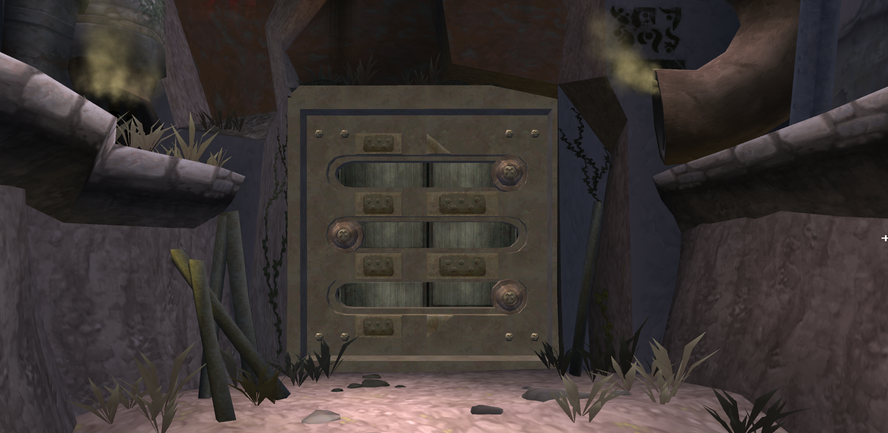


Next, add the entity to the custom level’s `.jsonc` file and do the following:

- Set the `etype` to `com-airlock-outer`
- Add the `idle-distance` lump and set it to `["meters", <VALUE_IN_METERS>]`  
  (_Defines the maximum distance at which the airlock becomes active_)
- Add the `distance` lump and set it to `["meters", <VALUE_IN_METERS>]`  
  (_Defines the distance threshold at which the airlock starts opening_)

Example:

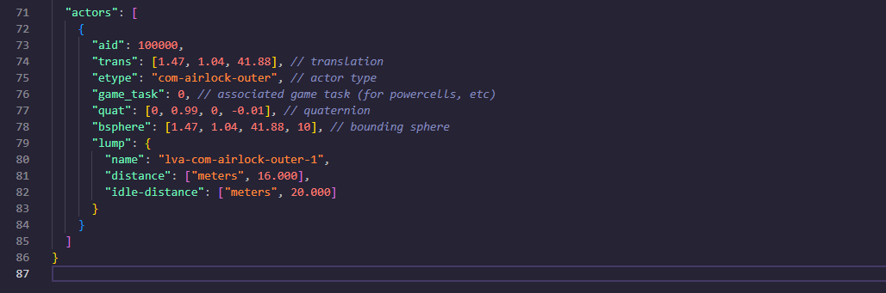

For the second level, let’s call it `level-b`, follow the same process as before.
However, this time use a different airlock art group: 

`com-airlock-inner-ag`

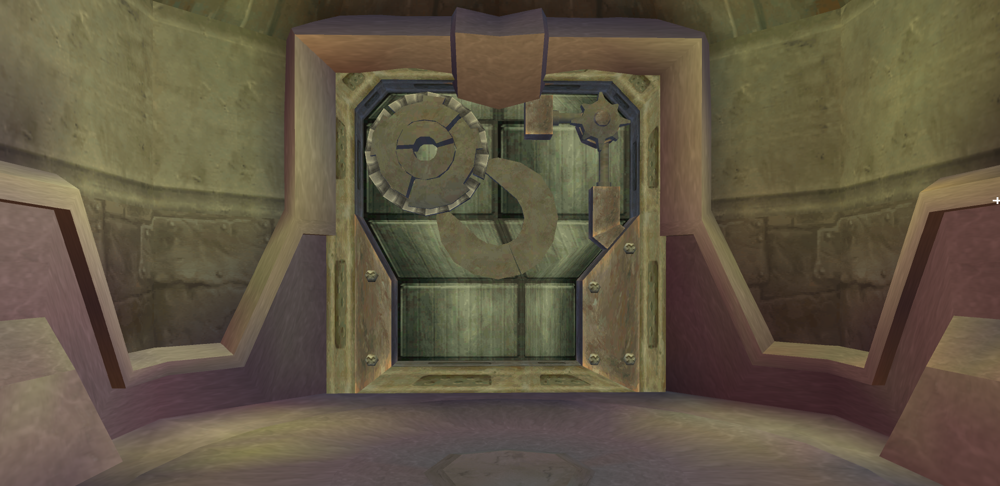

Now, set the `etype` in `level-b` `.jsonc` file to `com-airlock-inner`.

### Defining Airlock Behavior

Now, open the file:
`airlock-customizable-h.gc`

Scroll down to the bottom and copy the following content:

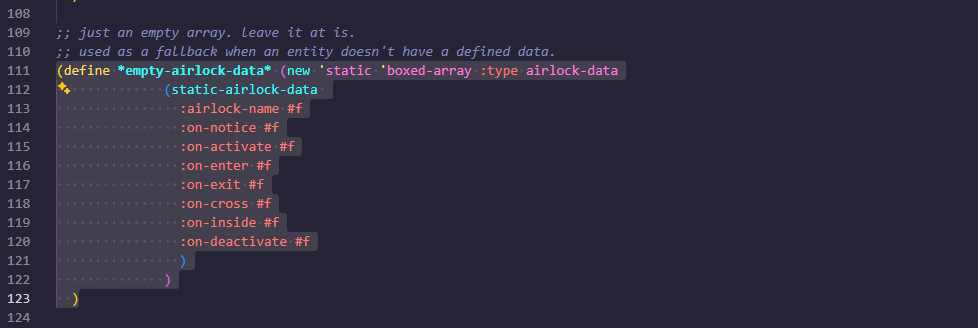

Inside the `airlock-data` folder, create a new folder called, for example, `my-level`.
Inside it, create two `.gc` files. I recommend using the following naming convention:

`<LEVEL_NAME>-airlock-data.gc`.

In this case, the files would be named `level-a-airlock-data.gc` and `level-b-airlock-data.gc`.

Then, at the top of both files, write `(in-package goal)` and paste the copied content inside each file.
Replace `empty` with the name of the level, matching the file name.

`level-a-airlock-data.gc`

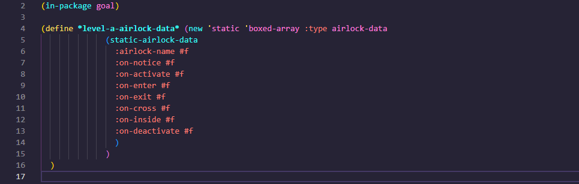

`level-b-airlock-data.gc`

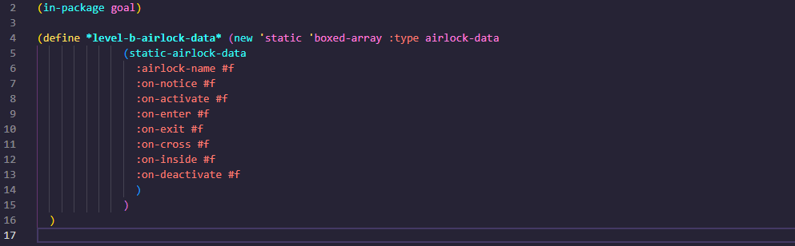

These files are used to define the behavior of the airlock entities placed in `level-a` and `level-b`.
You can add as many entries as needed for any airlocks or doors placed in your custom levels.

**Note:** It is recommended to check the `airlock-data` type defined at the top of the file
`airlock-customizable-h.gc`
for a better understanding of what each field shown in the image above does.

Next, you need to define the behavior for the `level-a` airlock to open and load `level-b`, and vice versa.
Now do the following:

- Set `:airlock-name` to the name of the airlock entity used in the level’s `.jsonc` file
  
    > **e.g.** `:airlock-name "lva-com-airlock-outer-1"`

- Set `:on-notice` to a pair that specifies which level must be loaded for the airlock to open
  > This is not limited to a simple pair. You may use more complex GOAL logic such as `cond`, `when`, or other conditional expressions,
    as long as the block ultimately evaluates to a valid action like `want-load`, `want-sound`, etc.
    This allows airlocks or doors to be locked behind game events, flags,
    inventory checks, or to conditionally load different levels behind the same entrance. <br> <br>
    Without task conditions: <br> <br>
      **e.g.** `:on-notice '(when #t '(level-b))` <br> <br>
    With task conditions: <br> <br>
      **e.g.** `:on-notice '(when (task-closed? "nest-boss-resolution") '(level-b))` 
  
- Set `:on-activate` to a pair that loads the required levels using `want-load`

    > **e.g.** `:on-activate '(want-load 'level-a 'level-b #f)`
  
- Set `:on-enter` to a pair that displays the required levels using `want-display`, accompanied by the `'display` symbol
  > You can also use `want-sound` here to load any required sound banks. <br> <br>
    **e.g.** `:on-enter '(begin (want-display 'level-b 'display) (want-sound 'ctywide1 'ctywide2 'ctywide3))` <br> <br>
    Or without `want-sound`: <br> <br>
    **e.g.** `:on-enter '(want-display 'level-b 'display)`
  
- Set `:on-exit` to a pair that hides the levels using `want-display`, accompanied by the `#f` symbol

  > **e.g.** `:on-exit '(want-display 'level-b #f)`

Below is an example:

`level-a-airlock-data.gc`

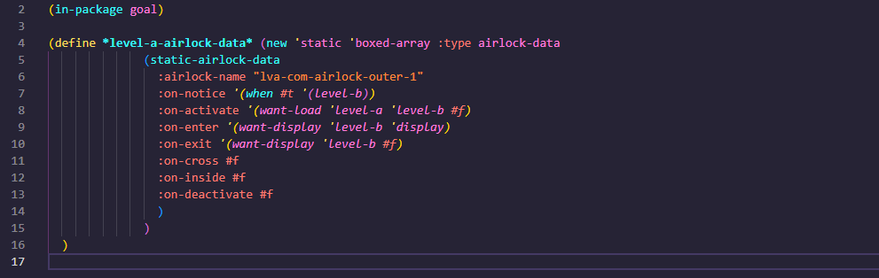

`level-b-airlock-data.gc`

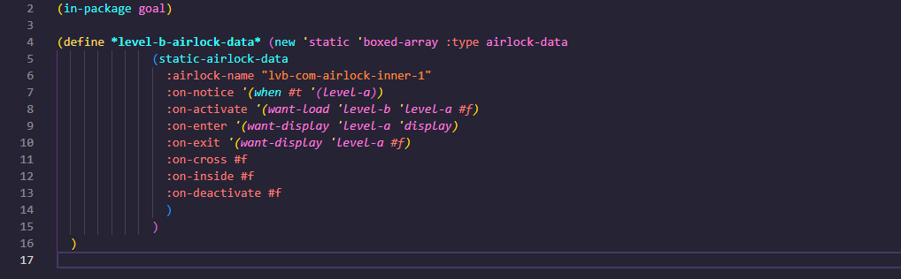

You can also optionally define `:on-cross`, `:on-inside`, or `:on-deactivate` for additional behaviors.

**Note:** If you’re still unsure or want more examples, it’s highly recommended to check the vanilla airlock and door data
inside the `airlock-data` folder, as they serve as a reference for defining airlock and door behavior in custom levels.

### Initializing the `airlock-data` Array

Now, you need to initialize the data you set up for the airlock and door entities through the following file:
`airlock-customizable.gc`
At the top of this file, you will find a method called `init-airlock-data-array!`. 
This method is responsible for initializing the `airlock-data` array associated with each airlock or door entity for every level. 
So, in order to do that you must add new `case` entries that match the airlock or door entity name and assign the corresponding `airlock-data` array to each case.
These new cases should be added before the `else` block, as shown below:

`airlock-customizable.gc`

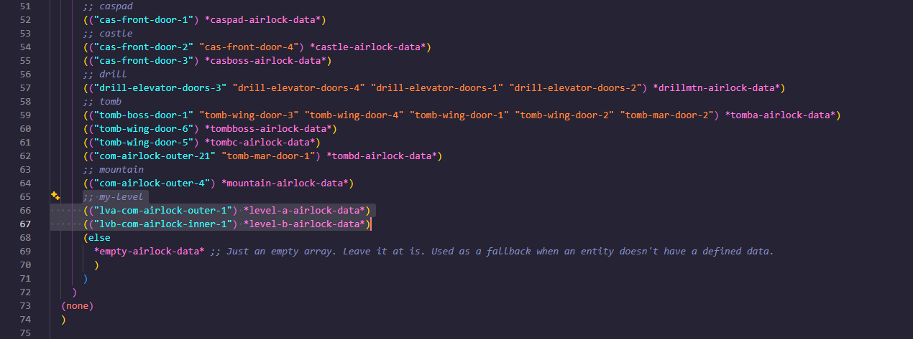

### Registering the `airlock-data` Files
After that, go to:

`<ROOT FOLDER>\goal_src\jak2\dgos\game.gd`

Scroll down and add an entry for both created files before `"airlock-customizable.o"`, as shown below:

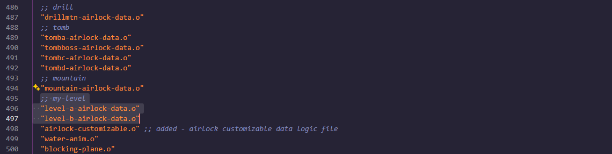

### Setting Up `next-actor` Lump

Finally, you need to set up the `next-actor` lump in both levels’ `.jsonc` files.
This allows the airlock in the level being loaded to open together with the one in the already loaded level.

To do this, add an `aid` (_Actor ID_) to both airlock entities.
Use a high value like `"aid": 100000` to avoid conflicts with other entities.

Then add the `next-actor` lump, structured like this:

`"next-actor": ["uint32", <ID_VALUE>]`

Make sure to add **unique IDs** for every airlock entity in your custom levels.
The `level-a` airlock `next-actor` must point to the `level-b` airlock actor ID, and vice versa.

The result should look like this:

`level-a.jsonc`

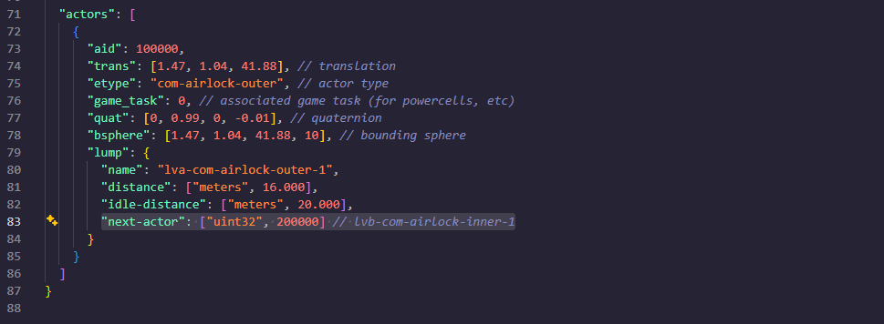

`level-b.jsonc`

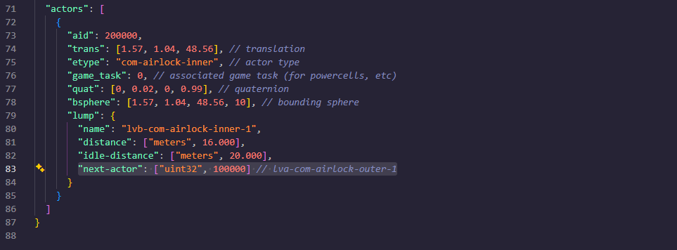

After completing this process, rebuild the game and test whether the airlocks work correctly in your custom levels.

_~~Nick07_
